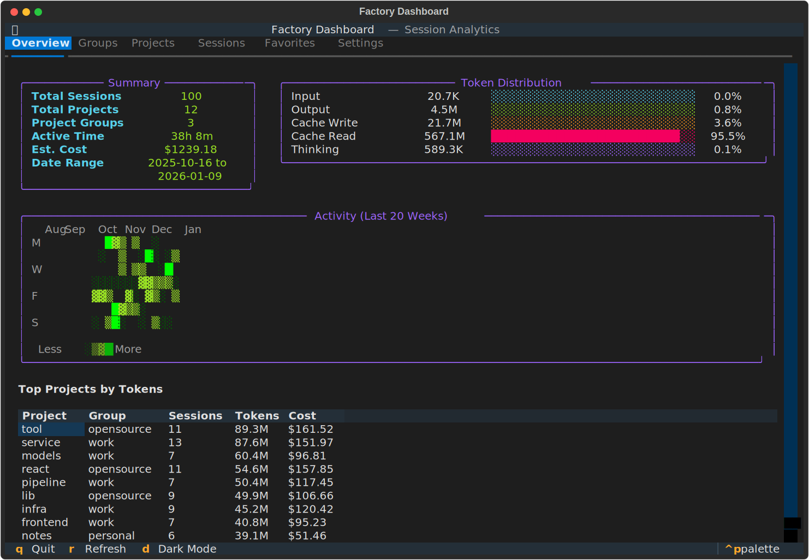
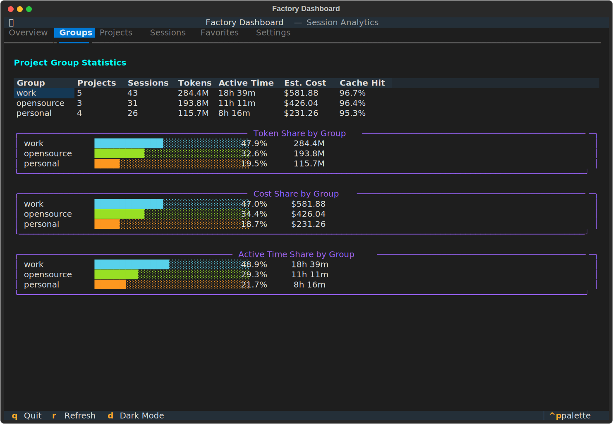
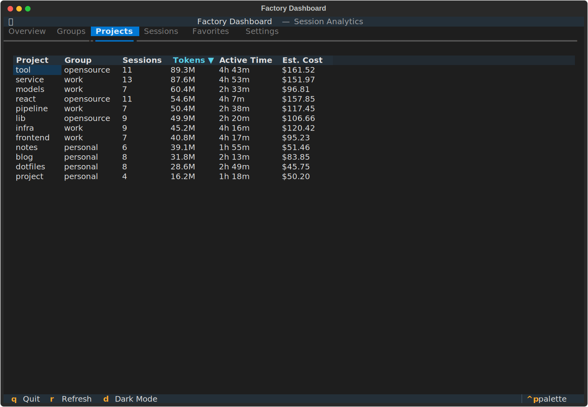
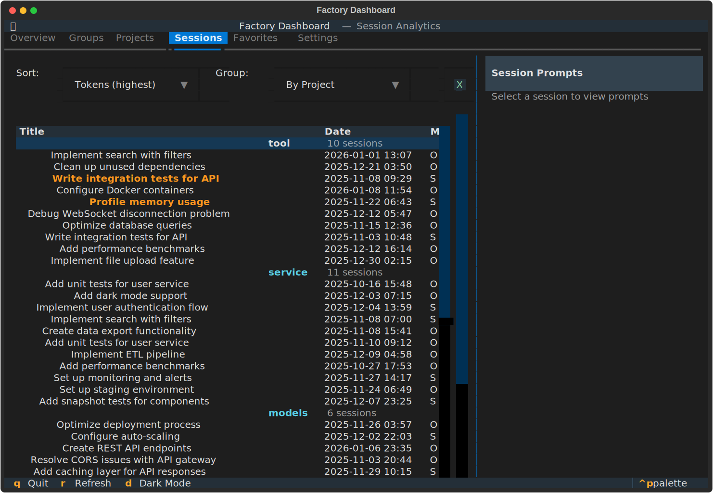
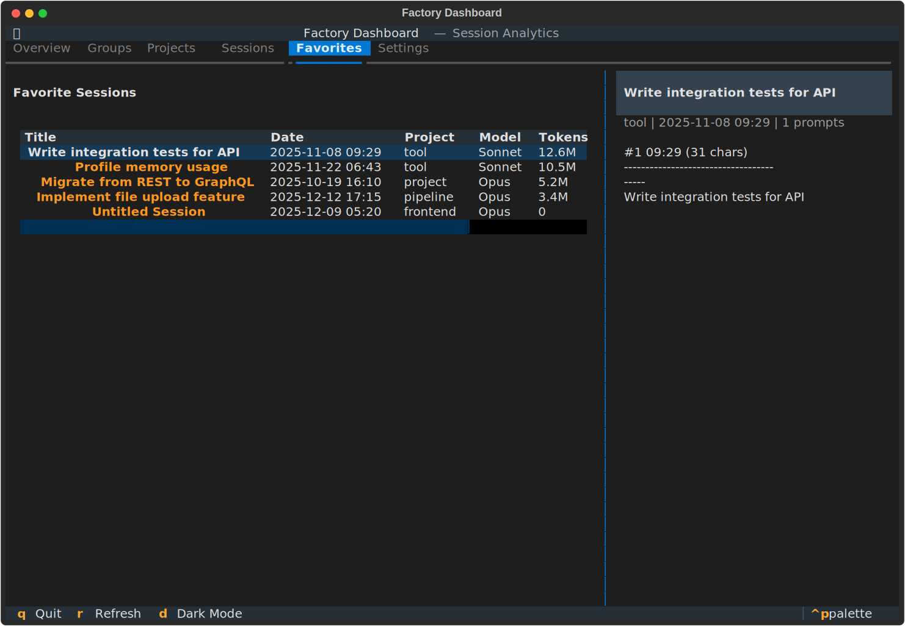
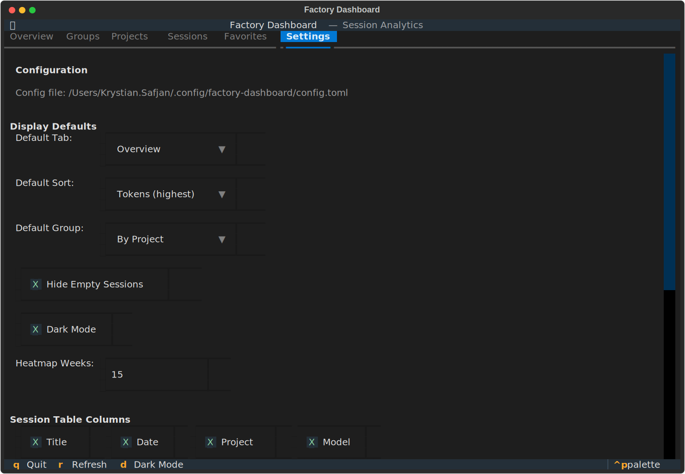
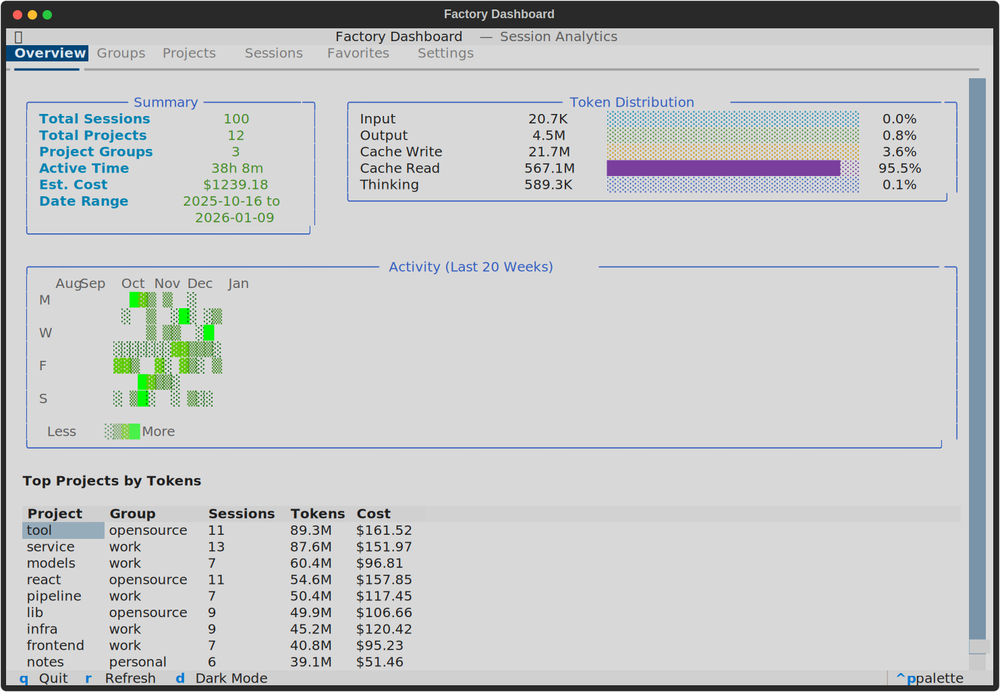

# Factory Dashboard

[](https://pypi.org/project/factory-dashboard/)
[](https://pypi.org/project/factory-dashboard/)
[](https://github.com/izikeros/factory-dashboard/actions/workflows/ci.yml)
[](https://opensource.org/licenses/MIT)

A terminal-based dashboard for analyzing [Factory.ai](https://factory.ai) Droid sessions. Track token usage, estimate costs, explore session history, and connect to previous sessions directly from the TUI.


<!-- TODO add recorded demo here -->
<!-- To regenerate screenshots: python scripts/take_screenshots.py -->

## Features

### Overview Tab

Total sessions, projects, and project groups at a glance with token usage breakdown, cost estimation, activity heatmap, and top projects.



- Summary statistics (sessions, projects, groups, active time, estimated cost)
- Token usage breakdown (input, output, cache creation, cache read)
- GitHub-style activity heatmap showing session frequency over time
- Top projects by token usage

### Groups Tab

Automatic grouping of projects by directory structure with aggregate statistics and visual share distribution.



- Statistics per group (projects, sessions, tokens, cost, cache hit ratio)
- **Token Share by Group** - horizontal bar chart showing distribution
- **Cost Share by Group** - horizontal bar chart
- **Active Time Share by Group** - horizontal bar chart

### Projects Tab

Per-project statistics with interactive column sorting.



- Click column headers to sort by that column
- Click same column again to reverse sort order
- Visual indicator (▼/▲) on sorted column with cyan highlight
- Columns: Project, Group, Sessions, Tokens, Active Time, Est. Cost

### Sessions Tab

Browse all sessions with sorting, grouping, filtering, and a side panel showing user prompts.



- **Sort by**: Date, Tokens, or Duration (ascending/descending)
- **Group by**: None, Project, Group, or Model
- **Filter**: Hide empty sessions (no prompts or "New Session" title)
- Side panel showing user prompts for selected session
- Favorite indicator (★) and bold yellow highlighting for favorites
- Edit session titles directly from the TUI
- Connect to session to resume in Droid

### Favorites Tab

Quick access to marked favorite sessions with the same features as the Sessions tab.



- All favorite sessions with prompts preview panel
- Toggle favorite status with `f` key
- Persistent favorites stored in `.favorites` file

### Settings Tab

Configure display defaults, column visibility, pricing, and paths.



- **Display Defaults**: Default tab, sort order, grouping, hide empty sessions
- **Dark Mode**: Toggle dark/light theme
- **Heatmap Weeks**: Number of weeks to display in activity heatmap
- **Column Visibility**: Show/hide columns in sessions table
- **Pricing**: Custom pricing per million tokens (input, output, cache write, cache read)
- **Paths**: Sessions directory location
- Configuration saved to `~/.config/factory-dashboard/config.toml`

### Light Mode

Toggle between dark and light themes with `d` key.



## Installation

### From Source

```bash
git clone <repository-url>
cd factory_ai_dashboard
pip install -e .
```

### Requirements

- Python 3.9+
- Dependencies: `textual`, `rich`, `click`, `pydantic`, `tomli` (Python < 3.11)

## Usage

### TUI Dashboard

Launch the interactive dashboard:

```bash
factory-dashboard
```

#### Keyboard Shortcuts

| Key | Action | Available On |
|-----|--------|--------------|
| `1` | Switch to Overview tab | All tabs |
| `2` | Switch to Groups tab | All tabs |
| `3` | Switch to Projects tab | All tabs |
| `4` | Switch to Sessions tab | All tabs |
| `5` | Switch to Favorites tab | All tabs |
| `6` | Switch to Settings tab | All tabs |
| `e` | Edit session title | Sessions, Favorites |
| `f` | Toggle favorite status | Sessions, Favorites |
| `c` | Connect to session (launch Droid) | Sessions, Favorites |
| `d` | Toggle dark/light mode | All tabs |
| `r` | Refresh data | All tabs |
| `q` | Quit | All tabs |

#### Connect to Session

Press `c` on a selected session to:
1. Exit the dashboard
2. Change to the session's original project directory
3. Launch `droid -r <session_id>` to resume the session

### CLI Commands

Quick access to statistics without launching the full TUI:

```bash
# Display overall statistics
factory-dashboard stats

# Filter by project group
factory-dashboard stats --group eyproj

# Token usage breakdown by project
factory-dashboard tokens
factory-dashboard tokens --limit 20

# List all project groups
factory-dashboard groups

# Export session data
factory-dashboard export --format json --output sessions.json
factory-dashboard export --format csv --output sessions.csv
```

### Custom Sessions Directory

By default, the dashboard reads from `~/.factory/sessions`. To use a different location:

```bash
factory-dashboard --sessions-dir /path/to/sessions
```

### Custom Configuration

Specify a custom configuration file:

```bash
factory-dashboard --config /path/to/config.toml
```

## Configuration

The dashboard supports persistent configuration via TOML files.

### Config File Locations

Configuration is loaded from (in order of priority):
1. Path specified via `--config` CLI option
2. `~/.config/factory-dashboard/config.toml`
3. `~/.factory-dashboard.toml`
4. Built-in defaults

### Configuration Options

```toml
[display]
default_tab = "sessions"        # overview, groups, projects, sessions, favorites
default_sort = "tokens_desc"    # date_desc, date_asc, tokens_desc, tokens_asc, duration_desc, duration_asc
default_group = "project"       # none, project, group, model
hide_empty_sessions = true
dark_mode = true
heatmap_weeks = 20

[columns.sessions]
show_title = true
show_date = true
show_project = true
show_model = true
show_tokens = true
show_favorites = true
show_prompts = true
show_duration = true

[pricing.default]
input_per_million = 3.0
output_per_million = 15.0
cache_write_per_million = 3.75
cache_read_per_million = 0.30

[pricing.models."claude-opus-4-5-20251101"]
input_per_million = 15.0
output_per_million = 75.0
cache_write_per_million = 18.75
cache_read_per_million = 1.50

[paths]
sessions_dir = "~/.factory/sessions"
```

## Architecture

The project separates the core backend logic from the TUI frontend, enabling future extensions (e.g., web UI).

```
src/factory_dashboard/
├── core/                  # Backend (reusable)
│   ├── models.py          # Data models (Session, Project, TokenUsage, UserPrompt)
│   ├── parser.py          # Session file parser (.settings.json, .jsonl)
│   ├── aggregator.py      # Statistics aggregation
│   ├── grouping.py        # Project grouping logic
│   ├── cost.py            # Cost estimation (Claude pricing)
│   └── config.py          # Configuration management (TOML)
├── tui/                   # TUI Frontend (Textual)
│   ├── app.py             # Main application, screens, and modals
│   └── widgets/           # Custom widgets (heatmap, stats panel, token bar, share bar)
└── cli.py                 # CLI entry point
```

### Data Flow

1. **Config** loads user preferences from TOML file
2. **Parser** reads Factory.ai session files from the sessions directory
3. **Aggregator** computes statistics and groups data
4. **Cost Estimator** calculates costs based on model pricing (configurable)
5. **TUI/CLI** presents the data to the user

## Session Data

The dashboard parses Factory.ai session files:

- `.settings.json` - Session metadata (model, token usage, active time)
- `.jsonl` - Conversation log with messages, prompts, and session start info (including `cwd`)
- `.favorites` - List of favorite session IDs (JSON array)

### Parsed Fields

From each session, the dashboard extracts:
- Session ID, title, and timestamp
- Token usage (input, output, cache creation, cache read, thinking)
- Model and autonomy mode
- Active time
- User prompt count
- Original working directory (`cwd`)

### Supported Models

Cost estimation supports Claude models with configurable pricing:
- Claude Opus 4
- Claude Sonnet 4
- Claude Haiku

## Development

### Running Without Installation

```bash
cd factory_ai_dashboard
PYTHONPATH=src python3 -m factory_dashboard.cli stats
PYTHONPATH=src python3 -m factory_dashboard.cli
```

### Generating Test Data

A script is included to generate fake session data for testing:

```bash
python scripts/generate_fake_sessions.py --sessions 100 --output ./test_sessions
```

Then run the dashboard with the test data:

```bash
factory-dashboard -d ./test_sessions
```

### Taking Screenshots

Generate screenshots for documentation:

```bash
python scripts/take_screenshots.py
```

Screenshots are saved to the `screenshots/` directory as SVG files.

### Recording Demo GIF

The demo GIF is created using [VHS](https://github.com/charmbracelet/vhs):

```bash
# Using Docker (recommended)
docker run --rm -v $(pwd):/vhs ghcr.io/charmbracelet/vhs demo.tape

# Or locally if VHS is installed
vhs demo.tape
```

## License

MIT

## Related

- [Factory.ai](https://factory.ai) - AI-powered software development platform
- [Textual](https://textual.textualize.io/) - TUI framework used for the dashboard
- [VHS](https://github.com/charmbracelet/vhs) - Terminal recording tool
